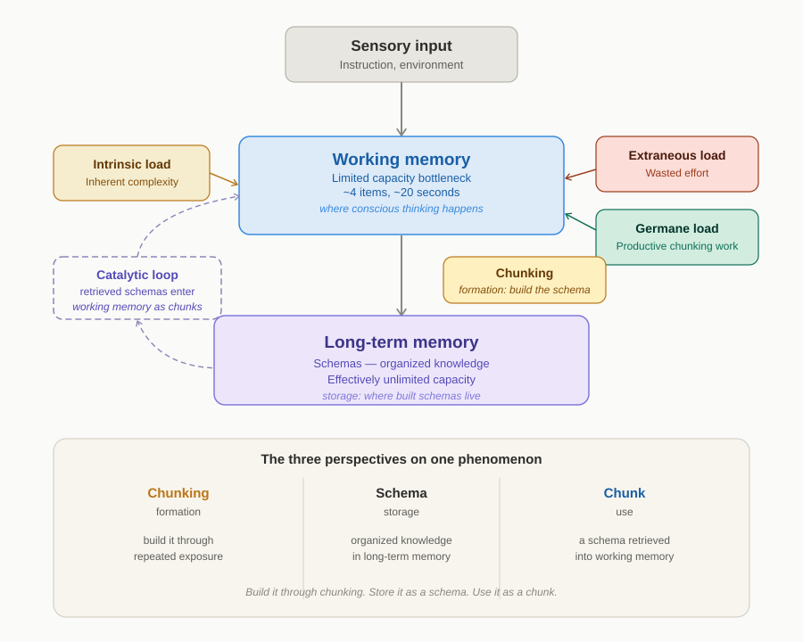
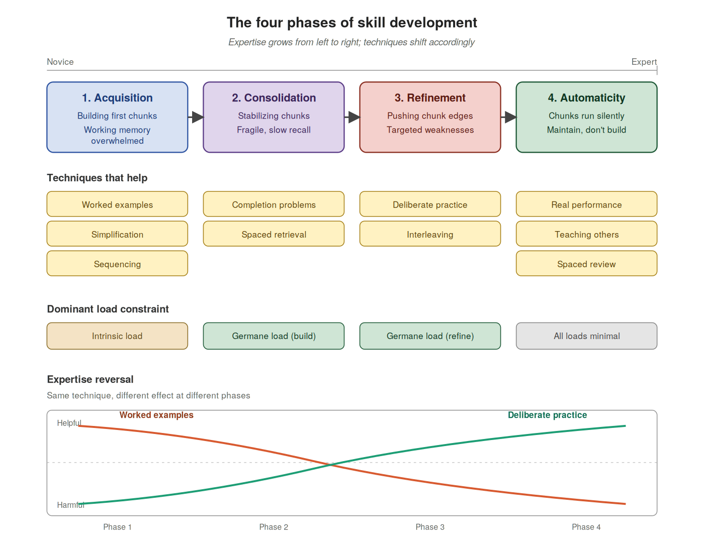

# How to actually teach yourself anything

There has never been a better time to teach yourself something. Every major textbook is online. Every programming language has a free tutorial. Every popular language has thousands of hours of comprehensible input on YouTube. The hard part used to be finding the material. That stopped being true years ago.

And yet most self-directed learning stalls. People start a new language, get to the point of basic conversation, and never push past it. They read a programming book, build a small project, and quietly conclude they're "not the type" who can really code. They pick up the guitar, learn five chords, and the guitar lives in a corner. The pattern is so common it's easy to assume it's about willpower or intelligence or lack of "natural ability."

I don't think it is. I've been teaching myself English for a couple of years now, and I've come to believe that most stuck self-learners aren't lazy or untalented. They're using techniques that don't match their stage of learning, often techniques that worked brilliantly a few months ago and have quietly turned counterproductive. The wrong tool for the wrong phase, applied with effort and discipline, produces frustration that looks a lot like personal failure.

There's a unified way to think about this, and it comes from a few decades of cognitive science research that hasn't quite filtered into the popular self-learning conversation. The core ideas are simple. Working memory is small. Long-term memory is huge. Almost everything that matters in learning is about how you bridge them.

This essay is my attempt to lay out that framework in usable form. I want to give you three things: a clear picture of how learning actually works inside your head, a way to diagnose where you're currently stuck, and a matched playbook for getting unstuck. None of it is novel science. I'm synthesizing work by John Sweller, Anders Ericsson, Barbara Oakley, and others. What's missing from the existing literature, in my experience, is a version written specifically for the person without a teacher. That's what I'm trying to write.

## Part 1: The bottleneck nobody told you about

Hold these two facts in your mind for a moment.

First: your working memory (the part of your mind where conscious thinking happens) can hold roughly four pieces of new information at once. Not seven, despite the famous old number; more recent research has revised it downward for genuinely novel material. Four items. Maybe twenty seconds before they fade without rehearsal.

Second: your long-term memory has, for all practical purposes, no upper limit. Nobody has ever found one. The information you've encoded over a lifetime (every face, every word of your native language, every route you've ever driven, every embarrassing thing you said in middle school) all of it sits in long-term memory, and there's room for vastly more.

The bottleneck between these two systems is the single most important fact about learning, and almost no learning advice talks about it directly. Everything you want to know has to pass through that four-item window. Every grammar pattern in a new language, every line of code, every chess opening, every sequence of medical symptoms: all of it has to be processed by a conscious mind that can only juggle a few pieces at a time. If the material has more interacting parts than working memory can hold, comprehension simply doesn't happen. You stall.

This explains a lot. It explains why learning feels exhausting in a way that other mental activity doesn't. It explains why you can read a paragraph three times and still not understand it. It explains why beginners need so much more time on tasks that experts breeze through.

But it raises an obvious question: how do experts breeze through? They have the same four-item working memory you do. A chess grandmaster has the same neurons as a beginner. A fluent English speaker isn't running on different hardware than someone who's just starting to learn the language. So how does the bottleneck get bypassed?

The answer is that it doesn't get bypassed. The bottleneck stays the same size, working memory still holds about four items. What changes is how much each of those items can carry, drawing on what's already stored in long-term memory.

To see how, you need to understand a single phenomenon viewed from three angles. The phenomenon is the way your brain compresses complex information into manageable units. Cognitive scientists describe it using three related terms (schema, chunk, and chunking), and these aren't three separate things. They're three perspectives on the same underlying mechanism, each useful for thinking about a different moment in its life cycle.

The first perspective is **storage**. A schema is an organized pattern of knowledge that your brain has built and kept in long-term memory. Think of it as a structured mental representation of something you've learned, with all its parts and how they relate. You have schemas for what a kitchen looks like, for the grammar of your native language, for how to ride a bicycle, for the rules of any game you know well. Once built, they sit in long-term memory waiting to be used.

The second perspective is **use**. When you encounter a relevant situation, your brain retrieves the schema and loads it into working memory, but not as the dozens of details it actually contains. It loads as a single integrated unit. That single unit, occupying one slot in your limited working memory, is called a chunk. A skilled chess player looking at a position doesn't see scattered individual pieces; they see "kingside castled with a fianchetto"—a single integrated unit that compresses what would otherwise be many separate items, retrieved from a much richer schema in long-term memory.

The third perspective is **formation**. Chunking is the active process by which schemas get built and gradually automated. When you encounter the same elements appearing together repeatedly (certain words in certain combinations, certain piano keys in certain sequences, certain symptoms appearing as a pattern), your brain notices the consistency and gradually binds those elements into an integrated unit. The fusion happens slowly, driven by repeated exposure and attention. Over time, what was several separate elements becomes one. That fusion is chunking, and it's the mechanism by which scattered experience becomes structured knowledge.

What makes this powerful is that the process compounds. Once a chunk exists, it can itself become a component of a larger one. Words fuse into phrases. Phrases fuse into sentence patterns. Each level absorbs the complexity of the level below, freeing working memory to operate at a higher level of abstraction.

There's a famous experiment that shows this happening. In the 1940s, the Dutch psychologist Adriaan de Groot showed chess players a board from a real game for five seconds, then took it away and asked them to reconstruct it. Grandmasters could place nearly every piece correctly. Amateurs managed only a handful. The obvious conclusion would be that grandmasters have superhuman visual memory.

Then de Groot ran the experiment again, this time with the pieces placed *randomly* on the board, not following the logic of any real game. The grandmasters' performance collapsed. They did no better than the amateurs.

The grandmasters didn't have better memory. They had something more interesting: thousands of chess schemas accumulated through years of play, each one capable of compressing a complex position into a single recognizable unit. When they looked at a real game, they didn't see scattered individual pieces. They saw "kingside castled with a fianchetto, queen developed, knights pinned"—a small number of meaningful patterns rather than many separate items. Their working memory was still the same size as anyone else's; the units it was juggling were just dramatically richer. When the pieces were random, no schemas matched, no chunks formed, and the grandmasters were back to processing piece by piece, exactly like everyone else.

This is why progress in any domain isn't linear. It feels slow at first because you're building small chunks. Then it accelerates as those chunks combine into larger ones. At some point, material that seemed impossible becomes easy. Not because the material got simpler, but because most of it has been chunked, leaving working memory free for the rest.

So when I use these three terms throughout the rest of the essay, I'm not pointing at three different things. I'm pointing at one thing from three angles. **Build it through chunking. Store it as a schema. Use it as a chunk.** The framework's central claim is that almost everything that matters in learning (every effective technique, every common failure mode, every plateau and breakthrough) comes back to how well you're driving this single underlying process.

A note on how this essay handles terminology. Cognitive science has a lot of technical terms, and most popular learning books either skip them entirely or pile them on without explanation. I'll use them when they're precise and useful, but I'll pair each one with a plain-language description on first use, so you have a handle to hold onto. The technical names are worth keeping because they let you recognize the same concept when you encounter it elsewhere; the descriptions are what actually keep them in working memory while you read.

Everything else in this essay is about how to drive this process effectively: how to study so that scattered elements actually fuse, schemas actually form, and chunks become available to working memory when you need them. The next section gives that process its proper introduction.

## Part 2: Chunking is the whole game

I want to push the metaphor a little further, because I think it changes how you should think about your own learning.

Chunks behave like catalysts. In chemistry, a catalyst is a substance that lowers the activation energy of a reaction without being consumed by it. Add a catalyst, and a reaction that was impossibly slow becomes routine. The catalyst itself isn't used up; it keeps doing its job, reaction after reaction, indefinitely. Cognitive chunks work the same way. They lower the activation energy of complex thought without being consumed when you use them. The schema for "kingside castled position" doesn't wear out the more chess games you analyze; if anything, it gets stronger. Once a chunk exists, it keeps paying dividends, every time you encounter material that activates it.

There's one important asymmetry, though. Chemical catalysts come pre-formed. Cognitive chunks have to be built, and the building costs real effort. There's an upfront investment phase where chunking is laboriously assembling units through repetition, attention, and engagement. Only afterward does the catalytic work begin. This is why early learning in any domain feels disproportionately hard: you're paying construction costs before you reap any benefit. Once enough chunks exist, the same domain starts to feel easy, and people often forget how steep the early climb was. They look at beginners struggling with material that now feels obvious to them and assume the beginners are slower, when really the beginners just haven't yet built the catalysts that the expert is unconsciously running on.

This reframe has a useful implication. Almost every effective learning technique you've ever heard of (worked examples, deliberate practice, spaced repetition, comprehensible input, retrieval practice, interleaving) is ultimately a tool for managing chunking at some stage of its work. Driving it during formation. Strengthening the schemas it produces. Refining them through targeted use. Maintaining them so they stay available. The techniques look different on the surface, and they apply at different points in the learning journey, but the underlying currency is always the same.

The rest of this essay is about which techniques to use when, and why the answer depends on where you are. But hold the central idea: every learning move you make is either driving chunking forward or competing with it. The next section breaks down the three forces that compete for your working memory.

## Part 3: The three forces fighting for your working memory

If working memory is the bottleneck, and chunking is the process you're trying to drive, the next question is practical: what determines whether your working memory is doing useful work or wasting itself? The answer comes from the educational psychologist John Sweller, who in the 1980s proposed that three different forces compete for your working memory's limited capacity, and good learning is largely about managing the balance between them.

He called them intrinsic load, extraneous load, and germane load. The names sound abstract; the ideas are not. Each one shows up in your daily learning life, and once you can recognize them, you start to see why some study sessions feel productive and others feel like running a treadmill.

I'll take them one at a time, because these three categories do most of the diagnostic work in the rest of this essay.

**Intrinsic load: the inherent complexity of what you're learning.**

Intrinsic load refers to the mental effort required by the inherent complexity of the material itself. Some things are simply harder to learn than others, because they have more interacting parts that must be tracked at once. Memorizing English vocabulary words is low intrinsic load: each word stands alone, and you can learn them one at a time without one word affecting another. Constructing a correct English sentence is high intrinsic load, because you have to coordinate tense, article use, subject-verb agreement, word order, and natural phrasing all at once, and getting any one wrong can make the whole sentence feel off.

You can't reduce intrinsic load by being clever about it. The material is what it is. But you can manage it through two techniques.

The first is **simplification**: working with material that's been stripped down to its essential parts, with non-essential detail removed. Real-world material usually contains both: the core elements a learner needs to chunk, and the incidental complexity (idioms, edge cases, ornamentation, advanced flourishes) that experienced practitioners include but that just adds load for beginners. A learner studying English doesn't read native-level fiction on day one; they start with graded readers that keep the core grammar and vocabulary but strip away the rest. A beginner programmer doesn't read a production codebase; they read teaching examples that show the core algorithm without the error handling and architectural decisions a real codebase would include. A pianist doesn't sight-read a Chopin nocturne; they play scales and pedagogical arrangements that preserve essential structure without the expressive demands. In each case, the simplification removes what isn't essential for the current level of learning, leaving the material processable for a learner who can't yet tell essential from incidental on their own. Simplification makes the present material digestible. It's the foundation that lets the next technique do its work.

The second is **sequencing**: introducing the parts in a logical order, where each step builds on the previous one. Learn vocabulary before trying to read literature. Learn basic grammar patterns before tackling idiomatic exceptions. Learn variables and conditionals before tackling object-oriented design. By keeping the intrinsic load manageable at each step, sequencing lets the learner devote germane load to building schemas, rather than spending it on complexity they're not yet ready for. This is where chunks actually accumulate: each step builds chunks that compress what came before, freeing working memory for the new layer. This is the accumulative nature of chunking from Part 1, applied as a design principle for your own study. Bad sequencing is one of the most common reasons self-learners stall. They pick a tutorial that introduces five new concepts at once when they only have chunks for two of them, and learning collapses under the load.

**Extraneous load: the wasted effort caused by how you're studying.**

Extraneous load refers to the mental effort spent on processing information that does not contribute to learning. This is the load that drains self-learners most, and it's the one most worth becoming sensitive to. Examples: a textbook that puts a diagram on one page and its labels on another, forcing you to flip back and forth. A YouTube tutorial that pads explanation with off-topic anecdotes. Trying to learn a new language while half-watching TV. Studying with notifications buzzing in your peripheral vision. Reading a tutorial that uses inconsistent terminology, so you spend half your working memory wondering if "this thing" and "that thing" refer to the same concept. None of this load is doing anything for you. It's pure overhead, and it directly cannibalizes the working memory you'd otherwise spend on chunking.

The fix for extraneous load is mostly subtractive. Pick one resource at a time and stay with it. Close the extra tabs. Put the phone in another room. Choose materials whose presentation respects your attention rather than fighting it. Self-learners often try to optimize by using more resources; usually the opposite is correct.

**Germane load: the productive effort that drives chunking.**

Germane load refers to the mental effort spent on actually building chunks: the productive cognitive work that fuses scattered elements into stable schemas. When you struggle with a new grammar pattern, hold an example sentence in mind, notice how it differs from what you already know, and finally see how the pieces fit, that's germane load doing its work. It's the load you want. The whole point of managing the other two is to clear space for this one.

Germane load isn't created by trying harder in some abstract sense. It's created by engaging actively with material at the right level of difficulty: wrestling with examples, retrieving concepts from memory rather than rereading them, explaining ideas to yourself in your own words, and connecting new material to schemas you've already built. Passive review feels like learning but produces almost no germane load. Active engagement does, and the techniques in Parts 5 and 6 are largely concrete ways to generate it.

**The practical summary.**

Three forces. **Manage** intrinsic load by simplifying and sequencing. **Reduce** extraneous load by ruthlessly cleaning up the conditions you study under. **Maximize** germane load by engaging actively with material at the right level. The first frees up working memory by lowering the difficulty entering it; the second frees it up by removing waste; the third spends the freed capacity on the actual work of chunking.

The diagram above shows how these three forces work together. Information enters through your senses, passes through working memory, and ideally lands in long-term memory as schemas through the chunking process. The three loads act on working memory simultaneously, all drawing from the same limited pool of capacity. Intrinsic and extraneous load pull capacity *away* from chunking; germane load *is* the working memory effort that chunking requires.

There's a feedback loop in the diagram worth noticing: schemas in long-term memory flow back up into working memory as chunks. This is the catalytic loop from the previous section, drawn in full. The more you've already chunked, the less working memory the new material consumes, because retrieved schemas compress what would otherwise be many separate items into single ones. This is also why learning gets easier the more you've learned, in any given domain. Your raw working memory hasn't expanded. You're recycling earlier work.

## Part 4: The four phases of skill

Skill development isn't a single process that runs at one speed. It moves through phases, and each phase is shaped by what kind of chunking work needs to happen next. The techniques that help in one phase can actively hurt in another, not because they're bad techniques, but because they're solving the wrong problem for where you currently are. This is the diagnostic insight at the heart of the essay: most stuck self-learners aren't lacking effort, they're suffering from **phase mismatch**, using techniques calibrated to a different phase than the one they're actually in. Recognizing the mismatch is most of the work.

There are four phases, and they unfold in a predictable order. I'll describe each one in terms of what it actually feels like, because the felt experience is how you'll recognize where you are.

**Phase 1: Acquisition. Everything is new and overwhelming.**

In this phase, you have few or no chunks for the material. Working memory is overwhelmed because every element is novel and has to be tracked separately. A new English learner trying to read a children's book is consciously decoding each word, looking up vocabulary, parsing grammar, and trying to hold the meaning of the sentence together, all at once, with no chunks to compress any of it. Working memory overflows. A beginner programmer reading a tutorial sees `for (let i = 0; i < arr.length; i++)` and has to consciously parse four separate things: the keyword, the variable, the condition, the increment. The bottleneck isn't motivation. It's that nothing has been chunked yet.

What it feels like from the inside: every study session is exhausting. You can't read for very long before your brain feels full. Material seems to slip out of your head as fast as it goes in. You suspect you're not very good at this. You're not wrong about the exhaustion: chunking is genuinely effortful work, and the upfront construction phase is the hardest part of any learning curve. You are wrong about not being good at it. You're a beginner. Beginners struggle because they haven't yet built the catalysts that make the material feel manageable.

**Phase 2: Consolidation. The chunks exist but they're fragile.**

Now you have rough chunks, but they're slow and unreliable. You can recognize patterns, but only with effort and only in clean contexts. An intermediate English learner can construct a basic sentence correctly when speaking slowly, but the same sentence collapses under the pressure of real conversation. An intermediate programmer can write a function from scratch when given time, but introduces bugs when adapting an existing one to new requirements. The chunks you've built are real, but they're brittle. They work in the conditions where you built them and fail at the edges.

What it feels like from the inside: you can do the thing, but it takes effort and you make consistent mistakes. You're past the "everything is new" exhaustion of Phase 1, but you're not yet at the "this is becoming natural" feeling that's coming. You feel like you should be progressing faster than you are. This phase often produces the most frustration, because the gap between "I understand how this works" and "I can do this reliably" feels embarrassingly large. The gap is not embarrassing. It's where most of skill development actually lives.

**Phase 3: Refinement. The chunks are solid but rough.**

You can do the thing reliably now, but not gracefully. Your English is functional but visibly accented. Your code works but isn't idiomatic. Your playing is correct but lacks expression. The bottleneck has shifted: it's no longer "can I produce the skill?" but "can I produce it well, in varied contexts, against real pressure, with the small errors and rough edges progressively eliminated?" This is the phase where deliberate practice (targeting specific weaknesses with feedback) does its most valuable work. It's also the phase that lasts the longest and that most ambitious learners spend the bulk of their time in.

What it feels like from the inside: improvement is real but harder to see. The big leaps of Phases 1 and 2 are over. You're now polishing, not building. Sessions that feel productive often produce only marginal gains, and sessions that feel unproductive sometimes produce surprising breakthroughs. You can no longer rely on the curriculum-shaped path that got you through earlier phases. At this point, you have to design your own practice, because no textbook is calibrated to your specific edge. Many self-learners stall here because they don't realize that the techniques that worked before have stopped working.

**Phase 4: Automaticity. The chunks run silently.**

The skill executes below the level of conscious attention. A fluent English speaker doesn't think about grammar; they think about what they want to say. A senior engineer doesn't think about syntax; they think about the problem. The chunking has accumulated to the point where the schemas are large, well-connected, and retrieved instantly without effort. Working memory is now free to do higher-order thinking (about meaning, strategy, style, intent) because the lower-level operations are running on their own.

What it feels like from the inside: the skill feels obvious. You forget what it was like to find it hard. This is also the phase where you can accidentally lose ground without noticing: chunks that aren't used periodically decay, and a few months without practice can leave you feeling rusty in ways that surprise you. Maintenance becomes the priority, not accumulation. You're not building anymore. You're keeping what you've built.

**The expertise reversal effect.**

Here's the part of the framework that catches the most people. The same technique can be helpful in one phase and harmful in another. This isn't a quirk; it's a predictable consequence of how chunking works.

Consider a worked example. For a beginner, studying a fully solved problem is enormously useful: it deposits chunks the learner can later use, and it manages cognitive load by letting them observe the structure rather than search for it. For an expert, the same worked example is harmful. The expert already has the relevant schemas; reading through the solution duplicates information they already possess and adds extraneous load by forcing them to process material their working memory could otherwise spend on the actual problem. The technique didn't change. The learner did. What was scaffolding has become noise.

Cognitive load theorists call this the **expertise reversal effect**: the principle that the same technique can flip from helpful to harmful as expertise grows. It's been replicated across many studies in the cognitive load theory literature. It applies to almost every learning technique you can name. Detailed explanations help novices and bore experts. Spaced repetition of basic vocabulary helps Phase 1 language learners and wastes time for Phase 4 ones. The technique itself isn't right or wrong; it's right for some phases and wrong for others.

The implication for self-learners is that you have to keep updating your toolkit as you progress. The methods that got you out of Phase 1 are not the methods that will get you out of Phase 2, and the methods for Phase 3 are something else again. People who plateau often do so not because they've hit some fundamental limit, but because they've kept using techniques that have aged out of usefulness for their current phase.

**You are in different phases for different sub-skills.**

One more crucial point before we move to the playbook. You are almost never in a single phase across all of a skill. A skill is made of many sub-skills, and each one progresses on its own track.

A self-taught English learner might be Phase 4 in casual conversation, Phase 3 in writing emails, Phase 2 in academic writing, and Phase 1 in legal or medical English. A self-taught programmer might be Phase 4 in writing basic functions, Phase 3 in system design, Phase 2 in database optimization, and Phase 1 in distributed systems. Each of those sub-skills needs the techniques appropriate to its phase, not the techniques that match the learner's overall self-image. This is why someone who feels generally competent at a skill can feel completely lost when they encounter an adjacent area: they're not regressing, they're just discovering a sub-skill that's still in Phase 1.

Of course, this raises a question: what counts as a sub-skill in the first place? The answer depends on the domain and on what you're trying to diagnose. The English-learner example above decomposes by context (conversation versus academic writing); the programmer example decomposes by technical area (functions versus distributed systems). Both decompositions are valid, and both reveal phase asymmetries the learner can act on. We'll come back to how to decompose your own skill into useful sub-skills in Part 7, where it becomes the first step of the diagnostic toolkit. For now, the important point is that you almost certainly have some sub-skills in early phases and others in later ones, and the techniques you need are different for each.

The diagnostic question isn't "what phase am I in?" The right question is "what phase am I in *for this specific sub-skill I'm trying to improve right now*?" That question is answerable, and the answer determines what to do.

## Part 5: The matched playbook

Now that you can identify which phase you're in for a specific sub-skill, here's what actually works at each one. The recommendations below aren't exhaustive (dozens of techniques have been studied in the cognitive science literature) but they're the ones with the strongest evidence and the clearest fit to each phase. If you do the right things at each phase and avoid the characteristic mistakes, you'll progress faster than most self-learners ever do.

**Phase 1: Acquisition. Lean on worked examples.**

In Phase 1, your job is to give the chunking process raw material to work with. You don't yet have the schemas that would let you produce the skill independently, so trying to produce it independently mostly produces frustration and copied patterns you don't understand.

In load terms, Phase 1 is dominated by intrinsic load. The material has more interacting parts than the learner's chunkless working memory can hold, and there are no schemas yet to compress the complexity. Extraneous load is especially dangerous here because there are no chunks yet to compress the material: working memory is processing every element separately, and any added load pushes useful processing out. The chunking process has barely begun. The first schemas are just starting to form through repeated exposure.

The single highest-leverage technique here is **studying worked examples**. A worked example is a fully solved problem: a complete English sentence with a translation, a finished function with annotations, a played chess game with commentary. The reason worked examples are so effective for beginners is that they manage all three loads at once. They reduce extraneous load by giving you a complete solution to study rather than forcing you to search for one. They manage intrinsic load by letting you focus on observing structure rather than generating it. And they free up germane load to do the actual chunking work, noticing how the parts fit together, recognizing patterns that will become your first schemas.

This is also where the two intrinsic-load techniques from Part 3 do their most important work. **Simplification** means working with material that's been stripped down to its essential parts, with non-essential detail removed: simple sentences before complex ones, single functions before multi-file programs. The point is to make the material processable now, so chunking can begin. **Sequencing** means introducing the parts in a logical order, where each step builds on the previous one, and this is where chunks actually accumulate over time. Sometimes good materials handle both for you: a graded reader is essentially pre-simplified and pre-sequenced, and an introductory programming book usually introduces concepts in dependency order. But often the sequencing is something you have to apply yourself: when no pre-sequenced material exists, breaking your study into smaller pieces and tackling them in order is the technique. Either way, the point is to face a manageable amount of intrinsic load at any moment, not all of it at once.

Good worked examples share a few features. They show one concept at a time rather than ten. They include enough explanation that you can follow the reasoning, not just the result. They use consistent terminology so you're not spending working memory on translation between sources. For language learning, a graded reader with translations and notes is essentially a sequence of worked examples. For programming, the small annotated programs in a well-written introductory book serve the same function. Spend more time studying and re-reading these than you think you should. Beginners almost always under-study and over-attempt.

The characteristic Phase 1 failure mode is **trying to do real work too early.** New programmers thrown into "build a project from scratch" before they have basic syntax chunks struggle and often quit, not because they lack motivation but because they're being asked to do Phase 3 work without Phase 1 chunks. New language learners who try to have unscripted conversations after two weeks of study are doing the same thing. The fix isn't to push harder. It's to spend more time in worked-example territory until the schemas are robust enough to support production.

**Phase 2: Consolidation. Bridge with completion problems and spaced retrieval.**

Once you have rough chunks, the work shifts. Studying more worked examples produces diminishing returns; you need to start exercising the chunks you've built so they become reliable. But pure independent production is still too much: the chunks aren't stable enough yet. The right tools sit between the two.

In load terms, the bottleneck has shifted. Intrinsic load is lower than in Phase 1 (your rough chunks now compress some of what was previously many separate items) but the chunks are fragile and break when working memory gets stressed. The work of Phase 2 is germane load: each effortful retrieval strengthens the schema and makes the next retrieval easier. Extraneous load remains a threat because the chunks aren't yet stable enough to handle waste. The chunking process is consolidating what Phase 1 began.

The first essential Phase 2 technique is **completion problems**. A completion problem is a partially worked example where you finish the last step. Then the last two steps. Then the last three. You're doing real production work, but with scaffolding that manages load. In load terms, completion problems work by keeping intrinsic load tractable through faded scaffolding (you only produce the part your fragile chunks can actually handle) while generating germane load through effortful production. The fading is the key: as your chunks stabilize, you take on more of the work, and the technique scales with you.

For a language learner, this might be filling in missing words in a translated paragraph, then missing phrases, then constructing whole sentences from prompts. For a programmer, it might be modifying an existing function to handle a new case, then writing a function similar to one you've studied, then writing one from scratch in the same pattern. The faded scaffolding is exactly calibrated to chunks that exist but need exercise.

The second essential Phase 2 technique is **spaced retrieval**: returning to material on a schedule and trying to retrieve it from memory each time. To see why it works, you need to understand what it's solving. In the 1880s, the German psychologist Hermann Ebbinghaus mapped what he called the **forgetting curve**: the rate at which newly learned material decays from memory if it's not revisited. Decay is rapid at first, with most of what you study gone within a day or two, and then slows. Without intervention, the curve continues downward until very little of the original material remains. Spaced retrieval is the technique that flattens the curve.

It does this by combining two well-studied effects from the cognitive science literature.

**Retrieval practice** is testing yourself instead of reviewing passively. Closing the book and trying to produce what you remember. Doing practice problems from scratch rather than re-reading worked solutions. Self-quizzing on vocabulary instead of looking at flashcards with both sides visible. The mechanism, sometimes called the **testing effect**, is that effortful retrieval strengthens the underlying schema in ways that passive exposure doesn't. Each successful retrieval makes the next one easier and the schema more durable. This is the **desirable difficulty** principle, the finding that effortful but successful retrieval strengthens memory more than easy retrieval. Retrieval practice is what you do *within* a study session to make that session actually stick.

**Spaced repetition** is distributing your reviews across time rather than massing them. The mechanism, called the **spacing effect**, is that distributed practice produces better long-term retention than massed practice. Cramming the night before an exam produces a higher score the next morning but worse retention a month later, because distributed reviews give the forgetting curve time to start flattening between encounters. Spaced repetition is what you do *across* study sessions to keep material from decaying once you've learned it.

The two combined (each scheduled return being an effortful retrieval rather than passive review) is what well-designed flashcard systems implement. The most well-known implementation is the **Leitner system**, developed by the German science journalist Sebastian Leitner in the 1970s. It uses a small number of fixed levels, each with a longer interval than the last:

- Level 1: Retrieve 10 minutes after learning
- Level 2: Retrieve 1 day later
- Level 3: Retrieve 4 days later
- Level 4: Retrieve 2 weeks later
- Level 5: Retrieve 2 months later

Each successful retrieval moves the item up a level, lengthening the next interval. Each failed retrieval moves it back to Level 1. The schedule reflects how the forgetting curve actually behaves: the first retrieval needs to happen quickly because decay is fastest right after learning, but once an item has survived several spaced retrievals, it can wait months before needing another.

For declarative knowledge (vocabulary, facts, concepts, formulas) flashcard tools that implement spaced retrieval handle the scheduling for you, so your job is to make the retrieval genuinely effortful. Try to produce the answer before flipping the card, even when you're not sure. The struggle is what makes it work. For procedural skills (speaking, playing, coding) the same principles apply but the schedule looks different. Periodic deliberate practice on elements you've previously worked on, especially after gaps where you might have forgotten them, prevents decay and consolidates what you've built.

The Phase 2 failure mode is **staying in comfortable beginner exercises.** This is where the most self-learners get stuck for the longest. They keep doing what worked in Phase 1 (reading more tutorials, watching more videos, studying more worked examples) when what they need is the discomfort of producing under partial scaffolding. The phase ends when you can produce reliably without the support, and you only get there by gradually removing it.

**Phase 3: Refinement. Switch to deliberate practice.**

By Phase 3, your chunks are robust enough to produce the skill independently. Now the goal is making it good. This is where **deliberate practice** (focused work on specific weaknesses with feedback, in the precise sense Anders Ericsson defined it) becomes the dominant technique.

In load terms, deliberate practice works in Phase 3 specifically because mature chunks have lowered intrinsic load enough that working memory can be directed at refinement rather than basic production. The technique concentrates germane load on weak points (the schemas that are still rough, the patterns that haven't yet stabilized) while leaving the rest of the skill running on autopilot. This is also where extraneous load takes a different form: the expertise reversal effect means that techniques which used to reduce load (worked examples, detailed explanations, basic exercises) now create extraneous load by duplicating schemas you already have. Recognizing this and dropping outdated techniques is part of the Phase 3 work.

Deliberate practice has four defining features that distinguish it from ordinary practice:

- **Specific weakness.** The work targets the exact edge of your current ability, not your existing comfort zone. If a session feels comfortable, you're not doing deliberate practice. You're doing rehearsal.
- **Focused attention.** The activity demands full engagement, not background-mode repetition. Most people can sustain genuine deliberate practice for limited periods: Ericsson's research on elite performers found that even at the highest levels, four to five hours per day was the practical ceiling, broken into shorter sessions.
- **Immediate feedback.** You need to know whether what you just did was right or wrong, ideally within seconds. Without feedback, you can't refine. You'll repeat the same mistakes for years and call it practice.
- **Repetition with refinement.** Each repetition includes an adjustment based on what the previous attempt revealed. The point isn't to do the thing many times; it's to do it a little better each time, with the previous attempt informing the next.

For a self-learner, the hardest of these to engineer is feedback. You don't have a coach watching you. The substitutes that actually work: record yourself and compare to a model (this works extraordinarily well for spoken language and for music), submit work to communities that will critique it (writing forums, code review platforms, language exchange partners), or use tools that score performance objectively (chess engines, language apps with native-speaker scoring, programming challenge sites). The feedback doesn't have to be perfect; it has to be *specific* enough that you can adjust.

The other Phase 3 technique worth naming is **interleaving**: mixing different types of practice within a session rather than blocking them together. Instead of practicing one type of problem for an hour, then another type for an hour, you alternate them in a mixed order. The cognitive science finding is that interleaved practice produces better long-term retention and transfer than blocked practice, even though it feels less productive in the moment.

In load terms, interleaving works by generating germane load specifically through discrimination. Each switch forces you to retrieve the right schema for the new context rather than running on autopilot, which is exactly the refinement work Phase 3 needs. A tennis player who practices serves for an hour and then returns for an hour is doing blocked practice; a tennis player who alternates serves, returns, and volleys in mixed order is interleaving. The blocked version feels productive because each shot type gets repetitive within a stretch and starts to feel automatic. The interleaved version feels harder because every shot requires discrimination, but that discrimination is what builds chunks that work in real play, where shots come in unpredictable sequences.

Interleaving is specifically a Phase 3 technique. In Phase 1, you don't have stable chunks for any of the patterns yet, so mixing them just produces confusion. In Phase 2, your chunks are still fragile and mixing them too early can break them down rather than strengthen them. By Phase 3, the chunks are stable enough that discrimination work becomes productive rather than overwhelming. Self-learners often abandon interleaving because it doesn't feel productive: the in-session experience is more error-prone and progress feels slower than blocked practice. That feeling is the signal that it's working, not the signal that you should stop.

The Phase 3 failure mode is **continuing to use Phase 1 techniques.** This is the expertise reversal effect biting hard. The advanced learner who keeps reading beginner tutorials, doing easy exercises, or reviewing material they already know is wasting time and reinforcing the illusion of progress. If a study session feels comfortable in Phase 3, it's almost certainly not productive. Real Phase 3 work feels uncomfortable: you're operating at your actual edge, and the edge is by definition where you're not yet competent.

**Phase 4: Automaticity. Maintain through real performance.**

Phase 4 isn't a destination so much as an ongoing state. The chunks are large, well-connected, and retrieved automatically. You're not building anymore; you're using and maintaining. The work shifts from acquisition to ecology: keeping the schemas active enough that they don't decay, exposing them to enough variety that they stay flexible, and integrating them into real performance contexts that demand the full skill at speed.

In load terms, all three loads are present but minimal. Intrinsic load is low because schemas are large and well-connected, compressing most of the material's complexity into single chunks. Extraneous load matters less because the chunks occupying working memory are now so dense that small waste doesn't crowd them out: the four-item limit is still there, but each item is doing the work of many. The bottleneck is decay rather than acquisition: schemas that aren't periodically activated become harder to retrieve quickly. Germane load through real use is what maintains them.

The most effective Phase 4 techniques are **real-world use, teaching, and occasional spaced exposure to the basics.** All three are forms of light germane load that prevent schema decay. Real use keeps chunks sharp because it forces retrieval under varied conditions. Teaching is especially valuable because explaining a skill to a beginner forces you to retrieve and articulate schemas you'd been running automatically, generating more germane load than passive use would, and often surfacing gaps you didn't know you had. Occasional return to fundamentals prevents the slow decay that affects even well-built chunks if they aren't periodically activated.

The Phase 4 failure mode is **skipping maintenance and assuming the skill is permanent.** It isn't. A few months without using a language degrades fluency in noticeable ways. A senior programmer who hasn't touched a particular language in two years needs a few weeks to get fluent again. The schemas don't disappear, but they become harder to retrieve quickly, and the catalytic loop runs less efficiently. Light, regular use is dramatically better than long gaps followed by intensive re-immersion.

The diagram above consolidates the playbook into a single picture. It shows the four phases with the techniques that help in each, and a small but important detail at the bottom: the curve showing how worked examples and deliberate practice trade places across the phases. Worked examples start helpful and become harmful; deliberate practice starts harmful and becomes essential. This crossing is the visual signature of expertise reversal, and it's the single most important pattern to internalize before applying the framework to your own learning.

## Part 6: Two case studies

The clearest way to see the framework working is to apply it to specific stuck states. Below are the struggles self-learners describe in their own words, in two domains, with what each one actually means in framework terms and what to do about it. If you've experienced any of these, you'll recognize them immediately, and if you haven't, they're a useful preview of the patterns to watch for.

**Case study 1: Self-teaching English.**

*"I know it but I can't use it." / "I understand a lot but I can't respond."*

These are two phrasings of the same mechanism. The schemas exist for recognition: you can identify the structure when you see it, recall it when prompted, explain it when asked. But the productive pathways haven't consolidated, because most of your study has been input-heavy: reading, listening, studying examples. Recognition has progressed to Phase 2 or Phase 3, while production stayed in Phase 1. The fix isn't more knowledge; it's production practice with partial scaffolding: completion exercises, output with corrections, gradually independent speaking and writing. The discomfort of producing imperfect English is exactly the work that builds productive chunks.

*"If I try to be correct, I become slow."*

This is the speed-accuracy trade-off characteristic of late Phase 2. The schema exists, but it hasn't fully automated yet: each retrieval still requires conscious working memory effort. In load terms, you're hitting a capacity limit: working memory is full juggling either accuracy concerns or fluency concerns, but doesn't have room for both. You can spend that capacity on accuracy and lose fluency, or spend it on fluency and lose accuracy, but you can't have both yet because there isn't enough working memory left over once one is being tracked. The fix isn't to choose which trade-off to live with; it's to keep producing under conditions that drive automation. More effortful retrieval is what eventually lets the schema run with less working memory cost, which is what frees up the capacity to be both fast and accurate. This is also where I'm currently doing most of my work.

*"I know the word when I see it but I can't use it."*

This is the receptive/productive vocabulary gap, one of the most studied phenomena in second language learning. Recognition only requires that the schema activate when the input matches it; production requires that the schema activate from intent and produce the right form. They're built by different practice. Reading builds recognition; speaking and writing build production. A learner who has read a lot but spoken little will have a productive vocabulary much smaller than their receptive one, often less than half, and the gap doesn't close by reading more. It closes by producing more.

*"I think in my language first."*

This is the catalytic loop running on the wrong schemas. Your first language has rich, automatic schemas built over decades, and those activate first when you want to express something. You then translate from those activated schemas into English, which is slow and produces unnatural phrasing. In load terms, the translation step adds intrinsic complexity to every utterance: you're doing two cognitive operations (form the thought in L1, translate to L2) where a fluent speaker does one. You can't fix this by trying to "stop translating." That's working against the mechanism. You fix it by building English schemas rich enough that they activate first for common situations. Sentence mining and contextual immersion work because they build chunks attached to situations rather than to first-language equivalents. Eventually the English schema is the one that activates first, the translation step disappears, and the intrinsic load of speaking drops accordingly.

*"I think I understand but I miss details."*

Your chunks are large enough to capture overall meaning but rough enough to lose precision. The catalytic loop is running, but coarsely: the schemas pulling into working memory are gist-level rather than detail-level. The fix is targeted attention to detail: not reading more volume, but reading more carefully, with focus on specific elements you tend to miss. In load terms, this redirects germane load away from broad pattern recognition (which you're already doing well) toward fine-grained schema construction. This borrows from deliberate practice (targeting a specific weakness with focused attention) applied to reading. The same applies to listening: watching the same scene repeatedly with attention to specific features rather than passing through new material at speed.

*"I can read but I can't understand spoken English."*

Reading and listening use partially separate chunks. Reading-aligned schemas use visual word boundaries and self-paced parsing; listening-aligned schemas have to recognize words despite contractions, reductions, regional accents, and no visual cues. A learner who has built reading chunks heavily and listening chunks lightly will have exactly this asymmetry. The fix is direct exposure to varied native speech: first slowed and clear, then natural, then varied across speakers and registers. Watching scripted shows with subtitles is a Phase 1–2 technique; unscripted podcasts and unsubtitled native content are Phase 2–3. Most learners under-invest in this sub-skill because reading feels more measurable.

**Case study 2: Self-teaching programming.**

*"I can follow but I can't build." / "I understand code when I read it."*

These are the programming versions of the recognition/production split. You can read a tutorial and follow what it's doing: the schemas are there for interpretation. But sitting down to write something from scratch is paralyzing because the productive pathways haven't been built. Most tutorials are input-heavy by nature, and learners who absorb them passively end up with strong receptive chunks and weak productive ones. The fix is the same as in language: completion problems, then small modifications to existing code, then independent production at the right scale. The discomfort of writing code that doesn't work is the work that builds productive chunks.

*"I know the language but I can't solve problems."*

This is a sub-skill mismatch. You can think of programming as involving at least two layered chunking processes that develop somewhat independently: chunking syntax and basic patterns (so you don't have to think about how to write a loop), and chunking problem-solving strategies (so you can recognize "this is a tree traversal" or "this needs a hash map"). A learner with strong syntax chunks and weak problem-solving chunks experiences exactly this gap. The fix is to study solved problems for their *strategy* rather than their syntax (why this approach, why not another, what pattern does this fit) and to do targeted practice on problem decomposition specifically. Algorithms and problem-solving books work well here, but only if studied as worked examples for strategy, not skimmed for solutions.

*"It works but I don't understand why."*

This is the cargo-cult coding pattern: a Phase 1 stuck state masquerading as Phase 2 progress. You've copied or modified code that produces correct output, but no schemas formed because the chunking process didn't engage. In load terms, copying generates very little germane load even though it feels productive: the cognitive work of *understanding why* is exactly what the technique skips. You have working code without working understanding. This is what happens when production is attempted before the foundational chunks exist. The fix is unsatisfying but unavoidable: step back, study worked examples that explain *why* the code works, and rebuild the chunks the rushed production phase skipped. Continuing to copy and modify will produce more working code without building the schemas that would let you reason about variations.

*"I struggle with fixing errors."*

Debugging is its own sub-skill, with its own chunking process, and most tutorials don't teach it explicitly. It requires schemas not just for the language but for *how programs fail*: common error patterns, the relationship between symptoms and causes, the systematic process of narrowing down where things go wrong. Self-learners often have months of writing experience and almost no debugging experience because their tutorial code mostly worked. The fix is deliberate practice on debugging specifically: working through broken code, reading error messages with care, and treating debugging as a skill to develop rather than a frustration to endure.

*"I keep learning but never build."*

This is the comfort trap of Phase 1 extended past its useful life. More tutorials, more courses, more videos: it feels productive because it's familiar and produces the sensation of accumulating knowledge. But once basic chunks have formed, additional input produces diminishing germane load. The chunking process needs production attempts to consolidate fragile chunks, and production is what most learners avoid by reaching for another tutorial. The discomfort of attempting production is exactly the work the chunking process needs to move forward. The fix is to deliberately transition to completion problems and small projects, even though it will feel less productive than continuing to study.

*"My code works but it's messy."*

This is the canonical entry point to Phase 3. Your Phase 2 chunks are reliable: you can produce working code consistently. But they're functional rather than refined. Idiomatic style, clean abstractions, appropriate patterns, good naming: these are Phase 3 refinements that come from concentrated germane load on specific weak schemas, which is what deliberate practice with feedback provides. Recognizing your code as messy is good metacognitive awareness; the question is whether you have the infrastructure to refine it. Code review, reading expert codebases, comparing your solutions to canonical ones: these are the Phase 3 practices that turn working code into good code.

**The pattern across all of these.**

These entries don't all share a single cause, but they share a diagnostic move. Some are phase mismatches: techniques appropriate to one phase being used at another. Others are sub-skill imbalances: heavy investment in recognition while production lags, strong syntax chunks but weak problem-solving chunks, fluent reading but stalled listening. A few are something else: working memory limits hitting at late phases, the wrong schemas activating first, chunks that are coarse rather than fine. None of them are about effort, talent, or motivation. They're about misalignment between where the learner is and what the learner is doing. You can read each entry through both frameworks at once: phase and sub-skill placement tell you *what's happening*, and load and schema language tells you *why*, which loads are dominating, which schemas are stalled, and where germane load needs to be redirected. The diagnostic move is the same in every case: name the sub-skill, locate it on the phase progression, identify what's actually limiting progress, and adjust accordingly. Nothing in this list requires harder work. Most of it requires *different* work, applied to the right thing.

## Part 7: The self-learner's diagnostic toolkit

By now you have the framework. The remaining question is operational: how do you apply it to your own learning, on your own, without a teacher? This section gives you a method. It's the systematic complement to the recognition-based diagnosis in Part 6: where Part 6 helped you spot stuck states you've already felt, this is the deliberate self-examination that surfaces the ones you haven't.

The method isn't a sequence of steps. It's a set of questions to ask yourself across several dimensions of your learning, in whatever order is useful. Each question diagnoses a different aspect of where you are and what's limiting progress. Together they give you a complete picture. None of them takes long to ask. All of them take real honesty to answer.

**Which sub-skill are you actually working on?**

The first question is what you're trying to diagnose. A "skill" like English or programming is too coarse to be useful: you're never in a single phase across the whole thing. The diagnostic work happens at the level of sub-skills.

There's no universal way to decompose a skill into sub-skills, but three angles usually surface them. The first is **function**: what is the skill being used for? For a writer, function gives you "narrating, persuading, summarizing, explaining." For a programmer, function gives you "writing new code, modifying existing code, debugging, designing systems." The second is **context**: in what situation is the skill being deployed? For an English learner, context gives you "casual conversation, formal writing, presentations, technical reading." The third is **component**: what mechanical or technical pieces does the skill involve? For a musician, component gives you "left-hand technique, sight-reading, rhythm, dynamics." Different decompositions are useful for different diagnostic purposes; you don't have to pick just one.

A decomposition is useful when each sub-skill could plausibly be in a different phase. If you split a skill into pieces and find that all the pieces feel like they're at the same level, you haven't decomposed it usefully: you've just renamed the whole skill. A useful decomposition reveals asymmetry. The English learner who realizes they're Phase 4 in conversation but Phase 2 in writing has done useful decomposition. The programmer who realizes they're Phase 3 in writing functions but Phase 1 in system design has too. That asymmetry is what the rest of the toolkit acts on.

Try this now, with whatever skill you're working on: name three to five sub-skills, and write them down. The act of naming them is itself part of the diagnostic work.

**What phase is each sub-skill in?**

For each sub-skill you've named, ask yourself a small set of questions. Can you produce this without a reference? How fast? With what kinds of errors? Can you do it under realistic conditions (at speed, under pressure, in varied contexts) or only in clean ones?

If you can't produce it independently at all, you're in Phase 1. You need acquisition: worked examples, simplification, sequencing. If you can produce it but it's slow, error-prone, or works only in clean contexts, you're in Phase 2. You need consolidation: completion problems and spaced retrieval. If you can produce it reliably but not gracefully, with visible roughness or specific weaknesses, you're in Phase 3. You need refinement: deliberate practice on specific weaknesses with engineered feedback, and interleaving to build discrimination. If it executes automatically and you're past the building stage, you're in Phase 4. You need maintenance: real performance, teaching, and occasional return to fundamentals.

The temptation here is to over-rate yourself. Most self-learners place themselves a phase ahead of where they actually are, because the felt experience of competence (recognition, comprehension, the sense of "I get this") runs ahead of the actual ability to produce. If you're unsure between two phases, assume the earlier one. The cost of treating yourself as a Phase 2 learner when you're actually Phase 1 is small; the cost of treating yourself as Phase 3 when you're Phase 1 is large.

**What loads are dominating your study?**

Even with the right sub-skill identified and the phase diagnosed, your study sessions can still bleed working memory through the three loads. This question audits how your working memory is actually being spent.

Start with extraneous load, because it's the one self-learners most consistently underestimate. Where is your working memory being wasted on things that aren't the material itself? Common sources: switching between resources mid-study, having the phone visible during practice, choosing tutorials that pad explanation with off-topic anecdotes, reading materials that use inconsistent terminology, multitasking with anything that demands attention. Each of these consumes working memory that could be doing chunking work. The fix is mostly subtractive: pick one resource, close the tabs, put the phone in another room, choose materials whose presentation respects your attention.

Then check intrinsic load. Are you applying simplification and sequencing to manage the complexity, or are you trying to take on too many interacting elements at once? Intrinsic load is the inherent complexity of the material: you can't reduce it, but you can manage how much of it you face at any moment. Simplification means working with material that's been stripped down to its essential parts, leaving non-essential detail out: simple sentences before complex ones, single functions before multi-file programs. Sequencing means ordering the parts so each one builds chunks the next one will rely on. If you're trying to learn five new concepts simultaneously when you only have stable chunks for two of them, you haven't applied either technique. The fix is to drop down to simpler material, or to break the current material into smaller pieces and tackle them in order. Most self-learners are bad at recognizing when intrinsic load is too high and stay in over-difficult material because dropping down feels like regression. Recognizing the need to simplify or re-sequence isn't regression; it's exactly the move the framework is asking you to make.

Finally check germane load. Are you actually generating productive cognitive effort, or just exposing yourself to material? Passive review feels like learning but produces almost no germane load. Active engagement does: wrestling with examples, retrieving concepts from memory rather than rereading them, explaining ideas to yourself, attempting production with scaffolding. If your study sessions feel comfortable and produce a sense of familiarity but not progress, you're probably consuming material without generating germane load.

**What's happening to your schemas?**

This question catches stuck states the phase placement alone can't diagnose. Your schemas might be in any of four states: getting strengthened (chunking is consolidating them through germane load), going coarse (you're encoding gist but losing detail), developing asymmetrically (the schemas for recognition are progressing while the schemas for production are lagging, or vice versa), or decaying (light maintenance has stopped, and the chunks are slipping).

Ask yourself: when I retrieve this skill, do my chunks feel sharper than they did a month ago, fuzzier, or about the same? Am I building productive schemas alongside the receptive ones, or is one running ahead of the other? Are there sub-skills I used to do well that have started feeling rusty?

Each of these states points at a different fix. Strengthening is the work you want: keep doing what you're doing. Going coarse means you need targeted attention to detail rather than more volume. Developing asymmetrically means you need to deliberately exercise the lagging side. If recognition is ahead, do more production; if production is ahead, expose yourself to more varied input. Decaying means light maintenance has lapsed and you need to bring the schemas back into circulation.

**Do you have feedback that's specific enough to act on?**

This is the dimension that has no good shortcut. Without feedback, you can't refine. You'll repeat the same mistakes for years and call it practice. Self-learners don't have teachers, which means the feedback has to be engineered.

The general principle is to make the gap between your output and a target visible and specific. Three reliable methods:

**Compare yourself to a model.** Record yourself doing the thing (speaking, writing, playing, coding) and compare your recording to expert work. The gap between the two becomes audible or visible in a way it isn't when you're producing in real time. This works extraordinarily well for spoken language (record yourself reading a passage, then listen to a native speaker read the same passage) and for music (record your playing, then compare to a reference recording). The discomfort of hearing yourself is the point. That discomfort *is* the feedback.

**Submit to a community.** Find a place where people who are better than you will critique your work. Writing forums, code review sites, language exchange partners, subject-matter Discord servers, online communities focused on the skill. The quality of feedback varies, but the volume and specificity often exceed what one teacher could provide. The risk is that feedback in communities tends toward general approval ("nice job!") unless you ask specific questions. Ask questions like "what's the weakest sentence here?" rather than "what do you think?"

**Use tools that score performance.** For some skills, software provides objective feedback that's better than human feedback for certain dimensions. Chess engines for chess. Pronunciation-scoring apps for spoken language. Programming challenge sites with test suites for code. Sports timing devices. The score isn't a complete picture, but it's specific and immediate, which is what feedback most needs to be.

The feedback you set up should be calibrated to your phase. Phase 1 needs feedback on whether your basic understanding is right; Phase 2 needs feedback on whether your production is correct; Phase 3 needs feedback on the specific weaknesses you're targeting. Generic feedback is rarely useful in any phase.

**A returnable monthly checklist.**

Once a month, sit down with the framework and ask yourself the questions in order. They take fifteen minutes and they prevent the slow drift into stuck states that go undiagnosed.

What sub-skills am I actually working on right now? Have any new ones emerged that I should name? Are some sub-skills running ahead of others in ways I should rebalance?

What phase is each sub-skill in, really, not aspirationally? Have any of them moved up since last month? Have any of them moved back, indicating decay?

Are the techniques I'm using matched to those phases, or am I doing Phase 1 work on a Phase 3 problem, or Phase 3 work on a Phase 1 problem?

Where is extraneous load coming from in my study setup? Am I applying simplification and sequencing to manage intrinsic load? Am I generating real germane load, or just consuming material?

What's happening to my schemas? Are they getting strengthened, going coarse, developing asymmetrically, or decaying through neglect? Are the productive ones developing alongside the receptive ones, or is one running ahead?

Do I have feedback loops for the sub-skills I most want to improve? Are they specific enough that I can adjust based on what they tell me?

Am I doing retrieval practice within sessions and spaced repetition across them, or just consuming material?

These questions don't take long to ask. They take real honesty to answer. The honesty is the point.

## Closing

The framework in this essay isn't a productivity hack. It won't make you faster than you would otherwise be in the next week. What it does is something less immediate and more important: it lets you spend the time you do study on work that actually compounds.

Chunks don't fade when you use them. They strengthen. Schemas built today become the catalysts that make tomorrow's learning easier, and the day after that easier still, until material that seemed impossible at the start of a year becomes obvious by the end. This is the central asymmetry of self-learning over time. People who use the framework year after year, matching techniques to phases, auditing their loads, watching what's happening to their schemas, engineering specific feedback, and maintaining what they've built through spaced retrieval, don't just learn faster than people who don't. They learn at an accelerating rate, because the catalysts they've built keep lowering the cost of building more. The gap can widen substantially over time. That's the projection the framework gives you, and it's why the work compounds.

I've been teaching myself English for a couple of years now, and the framework I've laid out is the one I wish I'd had at the start. I would have spent less time on grammar drills and more time on input. I would have moved from input to production sooner. I would have audited my loads more carefully and noticed how much extraneous load I was bleeding through scattered resources. I would have spent less time being frustrated with myself and more time recognizing which sub-skill was stuck and what was actually limiting it. I would have stopped, more often, to ask whether what I was doing was matched to what I actually needed.

I'm writing this for whoever is at the start of that learning, or stuck partway through it, and would benefit from the diagnosis I had to figure out the hard way. The framework isn't mine. It's a synthesis of decades of cognitive science research by Sweller, Ericsson, Oakley, Bjork, and many others. What's mine is the experience of needing it without having it, and writing it down in the form I would have wanted to find.

What you do with it is up to you. But I think the right thing to do is small and ordinary: pick one sub-skill you're working on right now. Identify what phase it's in. Look at what techniques you're using, what loads are dominating your study, and what's happening to your schemas. Ask whether all of it matches. Adjust if it doesn't. Then come back to the framework next month and do it again.

That's the whole method. It isn't dramatic. But applied consistently, over years, it produces the kind of learning that compounds into something most people never reach, not because they couldn't have, but because nobody told them how the work actually fits together.
